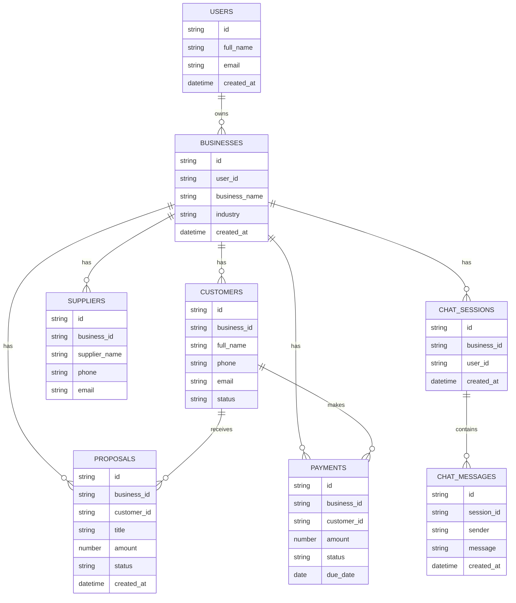

# MyPartner

MyPartner is an AI-based business assistant web application.  
The system helps small business owners understand business information such as customers, leads, payments, suppliers, open proposals and daily business questions through a simple Hebrew interface.

## Live Project

Vercel URL:  
https://mypartner-one.vercel.app/

## GitHub Repository

GitHub URL:  
[Add GitHub repository link here]

## Product Definition

### Problem
Small business owners often manage business information across many places: customers, payments, suppliers, proposals and tasks. This makes it difficult to quickly understand what is happening in the business.

### Target Audience
Small business owners and independent service providers who need a simple digital assistant for business management.

### Value
MyPartner provides a friendly AI assistant that allows the user to ask questions about the business and receive simple, clear answers in Hebrew.

### Differentiation
Unlike a regular CRM or dashboard, MyPartner focuses on a conversational AI experience, allowing the user to ask natural questions instead of searching manually through tables.

## Main Features

- AI business assistant interface
- Hebrew chat-style user experience
- Dashboard screens
- Customer-related area
- Proposals area
- Mobile-first responsive design
- Bottom navigation for app-like usage
- Clean UI and accessible layout

## Technologies

- React
- JavaScript
- CSS
- Vite
- GitHub
- Vercel

## External Services and Integrations

| Service | Type | Purpose |
| --- | --- | --- |
| GitHub | Version Control | Stores the project code |
| Vercel | Deployment | Hosts the live project |
| AI Service / OpenAI-ready structure | API / AI | Intended for AI-based business answers and text generation |
| Local React State / Frontend Data | Frontend Logic | Used for displaying business data and user interaction |

## ERD

The ERD describes the planned database structure for a production version of MyPartner.



## How to Run Locally

```bash
npm install
npm run dev
```
