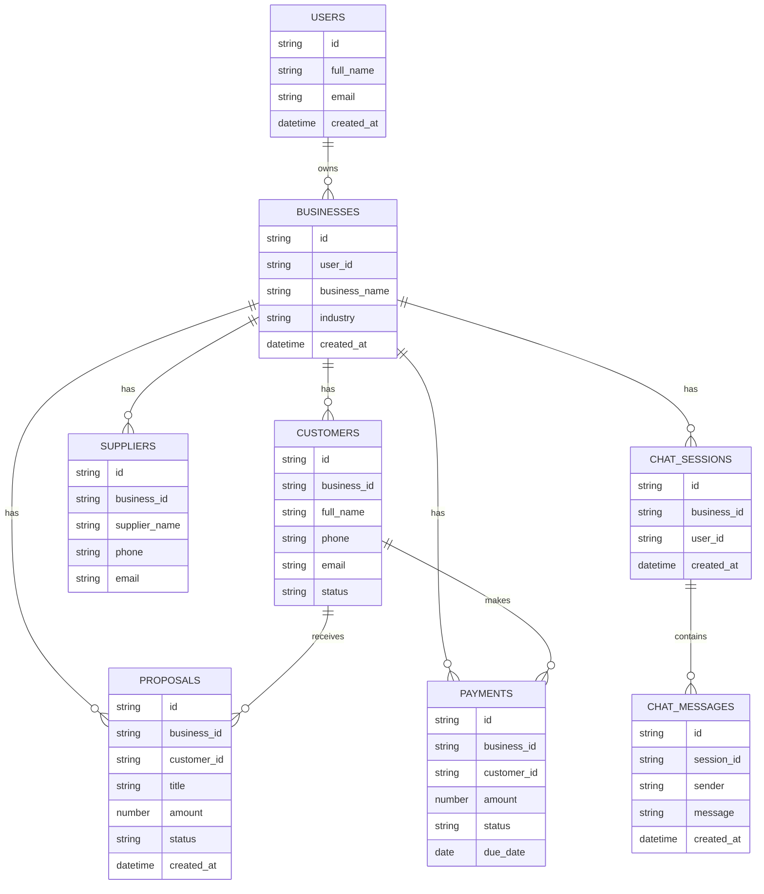

# MyPartner

MyPartner is an AI-based business assistant web application.
The system helps small business owners understand business information such as customers, leads, payments, suppliers, open proposals and daily business questions through a simple Hebrew interface.

## Live Project

Vercel URL:
https://mypartner-one.vercel.app/

## GitHub Repository

GitHub URL:
https://github.com/orenTauglil14/mypartner

## Demo Access

To test the app without registering, use the following credentials:

| Field    | Value               |
| -------- | ------------------- |
| Email    | demo@mypartner.co.il |
| Password | demo123456          |

Or register a new account — demo data (customers, quotes, invoices) is seeded automatically on first login.

## Product Definition

### Problem

Small business owners often manage business information across many places: customers, payments, suppliers, proposals and tasks.
This makes it difficult to quickly understand what is happening in the business.

### Target Audience

Small business owners and independent service providers (plumbers, electricians, contractors, etc.) who need a simple digital assistant for daily business management on mobile.

### Value

MyPartner provides a friendly AI assistant (ראובן) that allows the user to ask questions about the business and receive simple, clear answers in Hebrew — without navigating through complex menus.

### Competitors and Differentiation

| Competitor | Type | Limitation |
| --- | --- | --- |
| Excel / Google Sheets | Manual tracking | No automation, no mobile experience, requires setup |
| WhatsApp groups | Communication | No structure, no data, no reminders |
| Zoho / Monday.com | CRM platforms | Complex, expensive, English-first, not mobile-focused |
| Generic invoice apps | Single-purpose | No AI, no CRM, no full business view |

**MyPartner's differentiation:** Hebrew-first conversational AI built specifically for Israeli independent service providers — combines CRM, quotes, invoices, inventory and suppliers in one mobile-first app with a smart AI assistant at the center.

## Main Features

* AI business assistant interface
* Hebrew chat-style user experience
* Dashboard screens
* Customer-related area
* Proposals area
* Mobile-first responsive design
* Bottom navigation for app-like usage
* Clean UI and accessible layout

## Technologies

* React
* JavaScript
* CSS
* Vite
* GitHub
* Vercel

## External Services and Integrations

| Service                      | Type                               | Purpose                                                                                                |
| ---------------------------- | ---------------------------------- | ------------------------------------------------------------------------------------------------------ |
| GitHub                       | Version Control                    | Stores the project source code and project history                                                     |
| Vercel                       | Deployment                         | Hosts the live version of the project                                                                  |
| React / Vite                 | Frontend Framework                 | Builds and runs the client-side web application                                                        |
| AI-ready Assistant Structure | Frontend / Planned API Integration | Represents the planned AI assistant flow for generating business answers                               |
| Local Frontend Data          | Frontend Logic                     | Simulates business data such as customers, proposals, payments, suppliers and daily business questions |

> Note: The current version focuses on frontend, UI/UX and product flow. A production version can connect the AI assistant to an external AI API such as OpenAI through a secure backend function.

## ERD

The ERD describes the planned database structure for a production version of MyPartner.



## How to Run Locally

```bash
npm install
npm run dev
```

## Deployment

The project is deployed using Vercel.

Live project:
https://mypartner-one.vercel.app/

## Project Status

Final project version for submission.
